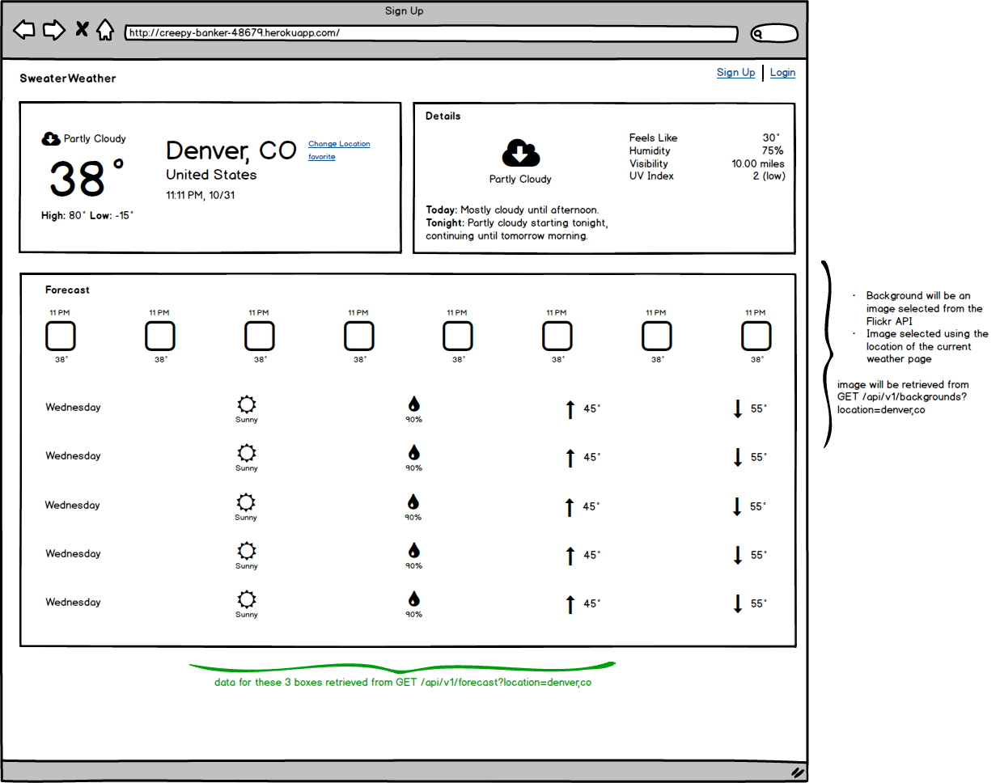

# whether_sweater

## README

This app allows users to create an account & login, as well as fetch the forecast for a location and future forecast for a destination upon arrival using google geocoding and dark sky api. This app utilizes the yelp and google maps api's to find restaurants that are open upon arrival. The Flickr api is used to retrieve a background image of a city.

The app is deployed at https://whether-a-sweater.herokuapp.com/.

This project was part of Turing School of Software & Design's Back End Engineering program. I This is a backend project built using Ruby on Rails.

View the project at https://backend.turing.io/module3/projects/sweater_weather.

Endpoints:
- http://localhost:3000/api/v1/forecast?location=denver,co

Request:
```
GET /api/v1/forecast?location=denver,co
Content-Type: application/json
Accept: application/json
```

Response:
```
{
  "data": {
    "id": null,
    "type": "forecast",
    "attributes": {
      "current_weather": {
        "datetime": "2020-09-30 13:27:03 -0600",
        "temperature": 79.4,
        etc
      },
      "daily_weather": [
        {
          "date": "2020-10-01",
          "sunrise": "2020-10-01 06:10:43 -0600",
          etc
        },
        {...} etc
      ],
      "hourly_weather": [
        {
          "time": "14:00:00",
          "wind_speed": "4 mph",
          "wind_direction": "from NW",
          etc
        },
        {...} etc
      ]
    }
  }
}
```

Request:
```
GET /api/v1/backgrounds?location=denver,co
Content-Type: application/json
Accept: application/json
```
Response:

This will return the url of an appropriate background image for a location.
An example of a response COULD look something like this:
status: 200
body:

```
{
  "data": {
    "type": "image",
    "id": null,
    "attributes": {
      "image": {
        "location": "denver,co",
        "image_url": "https://pixabay.com/get/54e6d4444f50a814f1dc8460962930761c38d6ed534c704c7c2878dd954dc451_640.jpg",
        "credit": {
          "source": "pixabay.com",
          "author": "quinntheislander",
          "logo": "https://pixabay.com/static/img/logo_square.png"
        }
      }
    }
  }
}
```

Request:

POST /api/v1/users
Content-Type: application/json
Accept: application/json

```
{
  "email": "whatever@example.com",
  "password": "password",
  "password_confirmation": "password"
}
```

Response:

status: 201
body:

```
{
  "data": {
    "type": "users",
    "id": "1",
    "attributes": {
      "email": "whatever@example.com",
      "api_key": "jgn983hy48thw9begh98h4539h4"
    }
  }
}
```

Request:

POST /api/v1/sessions
Content-Type: application/json
Accept: application/json
```
{
  "email": "whatever@example.com",
  "password": "password"
}
```
Response:

status: 200
body:

```
{
  "data": {
    "type": "users",
    "id": "1",
    "attributes": {
      "email": "whatever@example.com",
      "api_key": "jgn983hy48thw9begh98h4539h4"
    }
  }
}
```

```
POST /api/v1/road_trip
Content-Type: application/json
Accept: application/json

body:

{
  "origin": "Denver,CO",
  "destination": "Pueblo,CO",
  "api_key": "jgn983hy48thw9begh98h4539h4"
}
```

*Get restaurants by type that will be open upon arrival of destination
POST /api/v1/munchies
Content-Type: application/json
Accept: application/json

body:
{
  "start": "Denver,CO",
  "end": "Pueblo,CO",
  "food": "hamburger"
}

Response:
```
{
    "data": {
        "id": "hamburger",
        "type": "munchies",
        "attributes": {
            "end": "Pueblo,CO",
            "restaurant_list": [
                {
                    "city": "Pueblo",
                    "name": "Tortilleria Delicias",
                    "address": "926 S Santa Fe Ave"
                },
                {
                    "city": "Pueblo",
                    "name": "Grind Haüs Cafe",
                    "address": "209 S Union Ave"
                },
                {
                    "city": "Pueblo",
                    "name": "MAKS",
                    "address": "2535 Lake Ave"
                }
            ]
        }
    }
}
```

Here is a wireframe for the project:


To install: 
 - `clone this repo`
 - `$bundle`
 - `$bundle exec figaro install`
 
 * Database creation
 - `$bundle exec rails db:create`

* Database initialization
 - `$bundle exec rails db:migrate`

* How to run the test suite
 - `$bundle exec rspec`
 
 - Add your own API keys to `config/application.yml`:
 ```yml
GOOGLE_MAPS_API_KEY: <your google maps API key>
GEOCODING_API: <your google geocoding API key>
DARK_SKY_API: <your dark sky API key>
FLICKR_API_KEY: <your flickr API key>
FLICKR_SECRET: <your flickr secret>
YELP_CLIENT_ID: <your yelp client ID>
YELP_API_KEY: <your yelp API key>
 ```

* Ruby version: 2.4.1p111

* Deployment instructions
 - `$git push heroku master`
 - Add ENV variables with `$heroku config:set <KEY>=<value>`


